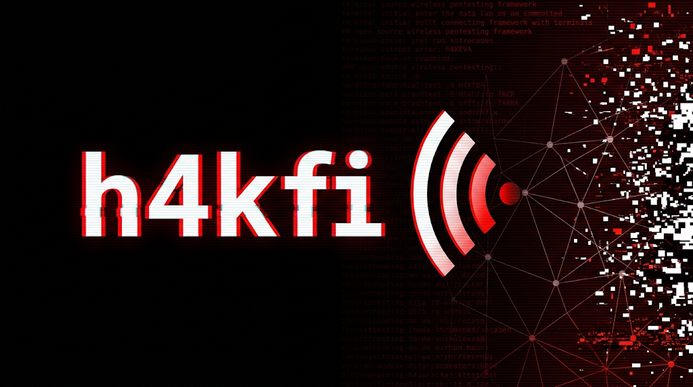
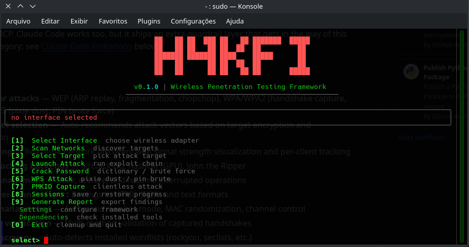

<p align="center">
  
</p>

<p align="center">
  <strong>Wireless penetration testing framework, built MCP-first for <a href="https://opencode.ai">OpenCode</a>.</strong>
</p>

<p align="center">
  <a href="LICENSE"></a>
  
</p>

Automates the full attack chain — recon through exploitation — from a terminal UI, a CLI, or an AI agent driving it over MCP. Claude Code works too, but it ships an extra guardrail layer that gets in the way of this specific tool category; see [Claude Code limitations](#claude-code-limitations) below.

<p align="center">
  
</p>

## Driving it with an AI agent

This is the point of h4kfi. Every tool — monitor mode, scanning, handshake and PMKID capture, WPS attacks, deauth, cracking — is exposed over MCP, so an AI agent runs the whole engagement from a plain-language brief. You describe the goal and the authorization; the agent picks the interface, scans, chooses a target, decides the attack vector from the encryption it sees, captures, and cracks — calling the tools itself and reacting to what each step returns. No flags to memorize, no fixed script.

A session in OpenCode looks like this:

> **You:** I'm authorized to test my own AP, SSID `HOME-5G`. Audit it end to end and try to recover the passphrase with rockyou.
>
> **Agent:** Enabling monitor mode on `wlan0`… scanning.
> Found `HOME-5G` on channel 36 — WPA2-PSK, −48 dBm, 2 associated clients. Best path is a 4-way handshake, so I'll deauth one client and capture, then crack offline.
> Captured and verified a handshake (`eapol` frames present). Running aircrack-ng against rockyou…
> Recovered the passphrase: `••••••••`. Interface restored to managed mode.

The agent made every tactical call — which client to deauth, when the capture was valid, which backend to crack with — from the tool output alone. You stayed at the level of intent and authorization. See [MCP Server](#mcp-server-ai-agent-integration) for setup.

## Features

- **Multi-vector attacks** — WEP (ARP replay, fragmentation, chopchop), WPA/WPA2 (handshake capture, PMKID), WPS (pixie dust, PIN brute force)
- **Smart target selection** — Auto-recommends attack vectors based on target encryption and configuration
- **Live scanning** — Real-time network discovery with signal strength visualization and per-client tracking
- **Multiple cracking backends** — aircrack-ng, hashcat (GPU), John the Ripper
- **Session management** — Save, restore, and resume interrupted operations
- **Report generation** — Export findings in HTML, JSON, and text formats
- **Interface management** — Automatic monitor mode, MAC randomization, channel control
- **Handshake verification** — Multi-method validation of captured handshakes
- **Wordlist discovery** — Auto-detects installed wordlists (rockyou, seclists, etc.)
- **MCP server** — Every tool above exposed to AI agents, OpenCode first

## Requirements

- Linux with a wireless adapter that supports monitor mode
- Python 3.9+
- aircrack-ng suite (required)
- Optional: hashcat, reaver, bully, hcxdumptool (v6.x supported), mdk4, macchanger

## Installation

### Install system dependencies

The framework wraps the aircrack-ng suite and related tools. Install them for your distro:

**Debian / Ubuntu / Kali:**
```bash
sudo apt update
sudo apt install -y aircrack-ng reaver bully hcxdumptool hcxtools hashcat macchanger mdk4 tshark
```

**Arch Linux:**
```bash
sudo pacman -S aircrack-ng reaver hashcat hcxdumptool hcxtools macchanger wireshark-cli
```

**Fedora:**
```bash
sudo dnf install aircrack-ng reaver hashcat hcxdumptool hcxtools macchanger wireshark-cli
```

Only `aircrack-ng` is strictly required. The rest unlock additional attack vectors (WPS, PMKID, GPU cracking, etc.).

### From source

```bash
git clone https://github.com/digenaldo/h4kfi.git
cd h4kfi
pip install .
```

### Development

```bash
git clone https://github.com/digenaldo/h4kfi.git
cd h4kfi
pip install -e .
```

### Verify installation

```bash
sudo h4kfi --version
```

## MCP Server (AI Agent Integration)

h4kfi includes an MCP (Model Context Protocol) server that exposes every wireless pentesting tool over standard MCP stdio transport. It's built and tested primarily against **OpenCode**, and also works with any other MCP-compatible client (Cursor, Codex, Gemini, Claude Code).

### Install with MCP support

```bash
pip install h4kfi[mcp]
```

### Privileges (required)

Every tool that touches the wireless interface (`list_interfaces`, `enable_monitor`, `scan_networks`, `capture_handshake`, `deauth`, etc.) needs root, same as `sudo h4kfi`. But MCP clients launch `h4kfi-mcp` as a stdio subprocess with no TTY attached, so plain `sudo` can't prompt for a password there — the process just fails or hangs.

Set up passwordless sudo scoped to the exact `h4kfi-mcp` binary path (find it with `which h4kfi-mcp`) — **not** a blanket NOPASSWD rule:

```bash
echo "$USER ALL=(root) NOPASSWD: $(which h4kfi-mcp)" > /tmp/h4kfi-mcp-sudoers
sudo visudo -c -f /tmp/h4kfi-mcp-sudoers   # validate before installing
sudo install -m 0440 -o root -g root /tmp/h4kfi-mcp-sudoers /etc/sudoers.d/h4kfi-mcp
```

This grants passwordless root execution of a binary that can run deauth attacks and crack captured passwords — scope it to the exact absolute path only, and be aware that whoever can invoke that path non-interactively (e.g. anyone with write access to it) gets that privilege too.

Then point your MCP client at `sudo -n <path>` instead of the bare command — the `-n` makes it fail fast rather than hang if the sudoers rule is ever missing.

### Configure for OpenCode (recommended)

Add an `mcp` entry to your OpenCode config (`opencode.json`, or `~/.config/opencode/opencode.json` for a user-wide setup):

```json
{
  "$schema": "https://opencode.ai/config.json",
  "mcp": {
    "h4kfi": {
      "type": "local",
      "command": ["sudo", "-n", "/path/to/h4kfi-mcp"],
      "enabled": true
    }
  }
}
```

OpenCode has no extra classifier layer on top of MCP tool calls — once the server is registered and the sudoers rule above is in place, all `h4kfi_*` tools are available to the agent without any further per-tool allowlisting. This is why OpenCode is the primary target for this project: for a tool category like wireless pentesting, where every call is inherently "legitimate recon that looks identical to an attack from the outside," a client that trusts your MCP permission model instead of re-judging each call itself is a better fit.

### Configure for Cursor

Add to `.cursor/mcp.json`:

```json
{
  "mcpServers": {
    "h4kfi": {
      "command": "sudo",
      "args": ["-n", "/path/to/h4kfi-mcp"]
    }
  }
}
```

### Configure for Claude Code (secondary option)

```bash
claude mcp add --scope user h4kfi -- sudo -n $(which h4kfi-mcp)
```

This works, but read [Claude Code limitations](#claude-code-limitations) below before relying on it — you'll need a manual permissions edit that OpenCode and Cursor don't require.

### Available MCP tools

| Tool | Description |
|------|-------------|
| `list_interfaces` | List wireless interfaces with mode/driver/chipset |
| `enable_monitor` | Enable monitor mode on an interface |
| `disable_monitor` | Restore interface to managed mode |
| `scan_networks` | Discover WiFi networks with encryption, signal, WPS, and per-client MAC/signal/packet details |
| `get_recommended_attacks` | Get attack vectors for a target based on encryption |
| `capture_handshake` | Capture WPA/WPA2 4-way handshake |
| `capture_pmkid` | Capture PMKID hash (clientless) |
| `wps_pixie_dust` | Run WPS Pixie Dust offline attack |
| `deauth` | Send deauthentication frames |
| `crack_handshake` | Crack handshake/PMKID with aircrack/hashcat/john |
| `verify_handshake` | Validate a capture file |
| `find_wordlists` | Discover installed wordlists |
| `check_dependencies` | Check installed tools |

## Claude Code limitations

Claude Code adds an auto mode classifier on top of MCP tool calls, and it doesn't play well with wireless pentesting tools specifically:

- **`scan_networks` gets denied as a "Third-Party Attack."** A monitor-mode scan necessarily picks up every nearby network's broadcast traffic, not just the one you're authorized to test — the classifier can't distinguish that from recon aimed at someone else's network, so it blocks the call by default even when the server is registered and running correctly as root.
- **The model can't fix this itself.** Granting the exemption means editing Claude Code's own permission settings, and that's separately blocked as "Self-Modification" — the agent is not allowed to expand its own allowlist, even for a tool it's already been given access to invoke.
- **You have to do it by hand.** Merge this into `~/.claude/settings.json` (don't replace the file wholesale — merge into whatever's already there):

```json
{
  "permissions": {
    "allow": [
      "mcp__h4kfi__list_interfaces",
      "mcp__h4kfi__check_dependencies",
      "mcp__h4kfi__enable_monitor",
      "mcp__h4kfi__disable_monitor",
      "mcp__h4kfi__scan_networks",
      "mcp__h4kfi__get_recommended_attacks",
      "mcp__h4kfi__capture_handshake",
      "mcp__h4kfi__capture_pmkid",
      "mcp__h4kfi__wps_pixie_dust",
      "mcp__h4kfi__deauth",
      "mcp__h4kfi__crack_handshake",
      "mcp__h4kfi__verify_handshake",
      "mcp__h4kfi__find_wordlists"
    ]
  }
}
```

This is Claude Code-specific — OpenCode and Cursor don't have this classifier layer, which is why they're the recommended clients for this project. Claude Code stays supported as a fallback option for people already standardized on it, but expect the extra setup step above, and expect it again on every machine you configure it on.

## Usage

### Interactive mode

```bash
sudo h4kfi
```

Launches the full TUI with menu-driven workflow — scan, select target, attack, crack.

### CLI mode

Scan networks:
```bash
sudo h4kfi scan -i wlan0mon -d 30
```

Capture WPA handshake:
```bash
sudo h4kfi capture -i wlan0mon -b AA:BB:CC:DD:EE:FF -c 6 -t 120
```

Crack a capture file:
```bash
sudo h4kfi crack handshake.cap -w /usr/share/wordlists/rockyou.txt
```

Use hashcat backend:
```bash
sudo h4kfi crack handshake.cap -w rockyou.txt --backend hashcat
```

## Attack Vectors

| Attack | Encryption | Method |
|--------|-----------|--------|
| ARP Replay | WEP | IV collection via ARP request replay |
| Fragmentation | WEP | Keystream recovery through fragmented packets |
| ChopChop | WEP | KoreK chopchop keystream extraction |
| Handshake Capture | WPA/WPA2 | Deauth + 4-way handshake capture |
| PMKID | WPA/WPA2 | Clientless key extraction from first EAPOL frame |
| Pixie Dust | WPS | Offline WPS PIN recovery via Raghav Bisht / Dominique Bongard |
| PIN Brute Force | WPS | Online WPS PIN enumeration |

## Configuration

Settings are stored in `~/.h4kfi/config.json`. Edit through the interactive menu or directly:

```json
{
  "interface": "wlan0",
  "scan_duration": 30,
  "deauth_count": 15,
  "handshake_timeout": 180,
  "default_wordlist": "/usr/share/wordlists/rockyou.txt",
  "crack_backend": "aircrack",
  "mac_randomize": false,
  "auto_crack": true
}
```

## Project Structure

```
h4kfi/
  cli.py          - Entry point, interactive mode, CLI commands
  ui.py           - Terminal UI components (Rich-based)
  scanner.py      - Network discovery and client tracking
  attacks.py      - WEP, WPA, WPS, PMKID attack implementations
  handshake.py    - Handshake capture and verification
  cracker.py      - Multi-backend password cracking
  interface.py    - Wireless interface management
  session.py      - Session persistence
  report.py       - HTML/JSON/text report generation
  config.py       - Configuration management
  deps.py         - Dependency checking
  mcp_server.py   - MCP server (AI agent integration)
```

## For agents & contributors

Building on h4kfi, or having an AI agent install or extend it? Start with [AGENTS.md](AGENTS.md) — safety rules, AI-driven install, and development/release workflow — and the behavior specs in [specs/](specs/).

## Credits

h4kfi is a fork of [AutoWIFI](https://github.com/momenbasel/AutoWIFI) by momenbasel, refocused around MCP integration. See [NOTICE.md](NOTICE.md) for what changed.

## Legal

This tool is intended for authorized security testing and educational purposes only. Unauthorized access to computer networks is illegal. Always obtain proper written authorization before testing.

## License

GPL-3.0
